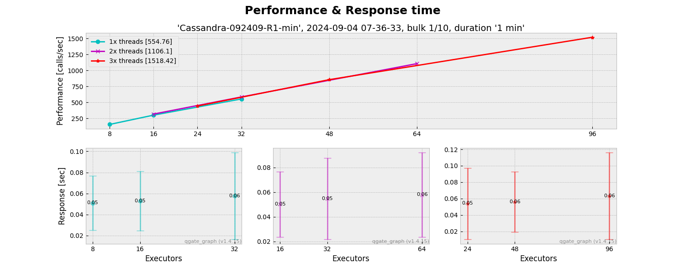
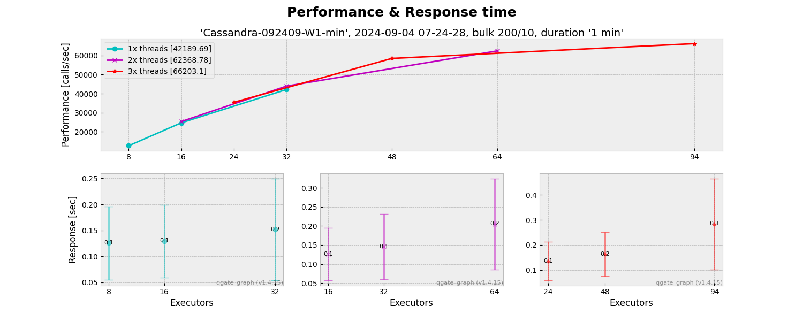
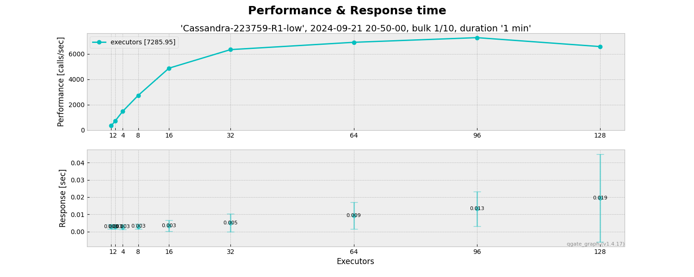
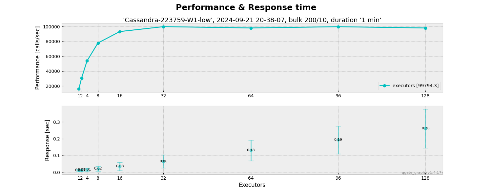
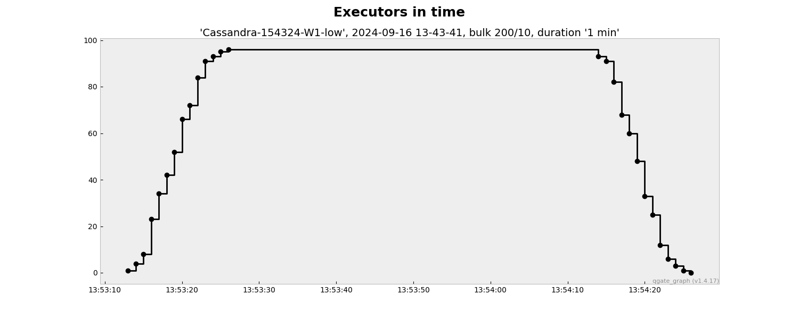
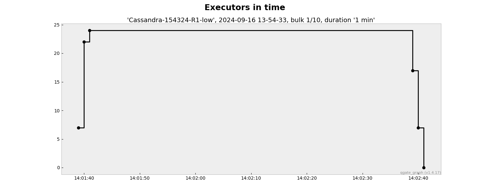

# Output description
 

## 1. Performance graphs

The sample outputs:
   - Performance graphs
     
     
     
   - 
  - Executors graphs
    
    

### 1.1 Relation of ENV file vs name of graphs (in PNG format)

 - **PRF-\*1-low-\*.png**
   - CASSANDRA_LABEL = 1-low
   - CASSANDRA_REPLICATION_CLASS = **NetworkTopologyStrategy** 
   - CASSANDRA_REPLICATION_FACTOR = **2** 
   - CASSANDRA_CONSISTENCY_LEVEL = **LOCAL_ONE**

 - **PRF-\*2-med-\*.png**
   - CASSANDRA_LABEL = 2-med
   - CASSANDRA_REPLICATION_CLASS = **NetworkTopologyStrategy** 
   - CASSANDRA_REPLICATION_FACTOR = **3** 
   - CASSANDRA_CONSISTENCY_LEVEL = **EACH_QUORUM**

 - **PRF-\*3-hgh-\*.png**
   - CASSANDRA_LABEL = 3-hgh
   - CASSANDRA_REPLICATION_CLASS = **NetworkTopologyStrategy** 
   - CASSANDRA_REPLICATION_FACTOR = **3** 
   - CASSANDRA_CONSISTENCY_LEVEL = **ALL**